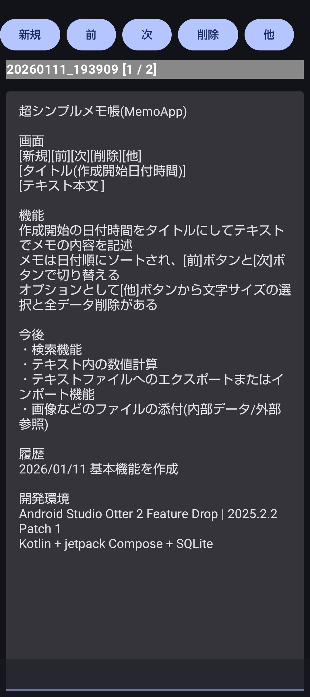

## 超シンプルメモ帳(MemoApp)

### 起動画面

### 画面
[新規][前][次][削除][他]  
[タイトル(作成開始日付時間)]  
[テキスト本文            ]  

### 機能
作成開始の日付時間をタイトルにしてテキストでメモの内容を記述  
メモは日付順にソートされ、[前]ボタンと[次]ボタンで切り替える  
オプションとして[他]ボタンから文字サイズの選択と全データ削除がある  

### オプション機能
・計算  
　全テキストの中から数式文字列を抽出して '=' までの数式を計算して結果を '=' の後ろに挿入する  
　'==' があるとそこまでのデータはスキップする  
　四則演算(+,-,*,/)と剰余(%),べき乗(^),階乗(n!)の演算処理が可能  
　途中に数値や演算子以外の文字列は無視されるのでコメントとして挿入できる  
　数値と文字列は演算子またはスペースで区切る   
　数値や演算子以外で始まる文字列は数値が入っていても数値以外と判断する  
・共有  
　他のアプリにテキストを転送する  
　また他のアプリからの共有で転送された文字列も受けられる
・文字サイズ選択  
　文字サイズを変更する(標準 16.sp)  
　(編集操作を行うかページを変えると新しい文字サイズが反映される)  
・全データ削除  
　すべてのデータを削除する  

### 今後
・検索機能  
・テキスト内の数値計算  
・テキストファイルへのエクスポートまたはインポート機能  
・画像などのファイルの添付(内部データ/外部参照)  
・共有機能

#### インストール方法
実行ファイルのダウンロードは[memoapp-debug.apk](memoapp-debug.apk)をダウンロードする。  
  
(スマホでダウンロードする場合は中央の[View raw]をクリックするとダウンロードができる)  

・インストールを行う前にスマホを開発者オプションの設定にする(Android12/13)  
1.	スマホの設定アプリを開く
2.	デバイス情報 (端末情報)をタップ
3.	下のほうに「ビルド番号」という項目があるので、10回程度タップする
4.	設定アプリの最初に戻って「システム」をタップ
5.	「開発者向けオプション」が表示されるのでタップ
6.	一番上の「開発者向けオプションの使用」をタップして開発者向けオプションを有効化する

・インストール  
GoogleのFilesアプリでダウンロードしたファイル(mapapp-debug.apk)をタップするか、ファイルを選択してから右側の点をタップするとメニューが表示されるのでインストールを選択するとインストールが開始される。  

・起動時の設定  
アプリ起動時にファイルアクセスの設定が有効になっていないと「ファイルアクセス」の設定画面が開くので、そこでアプリ(いろんな地図)を選択して「全ファイルの管理権を付与」を有効にする。  
・その他のアクセス権の設定  
アンドロイドのホーム画面から「設定」を開いて「アプリ」「いろんな地図」を選択した画面で「権限」を選択して「許可しない」項目にある権限(位置情報、身体活動)を選択して権限の許可をおこなう。  
これが設定されていないとGPSトレースや歩数計測が使用できない。  

### 履歴
2026/01/15 計算機能追加  
2026/01/13 共有機能を追加  
2026/01/13 削除を繰り返すとダウンすのを修正  
2026/01/11 基本機能を作成  

### 開発環境
Android Studio Otter 2 Feature Drop | 2025.2.2 Patch 1  
Kotlin + jetpack Compose + SQLite  
