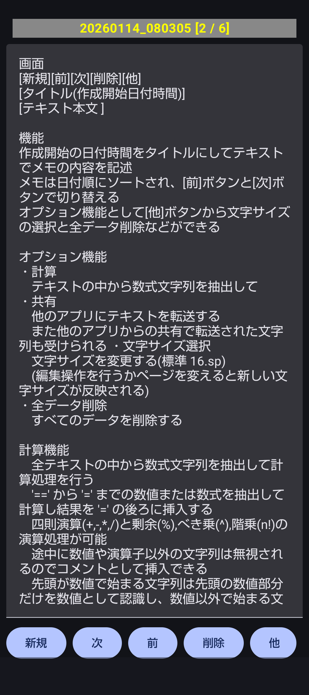

## 超シンプルメモ帳(MemoApp)

### 起動画面

### 画面
[タイトル(作成開始日付時間)]  
[テキスト本文            ]  
[新規][次][前][削除][他]  

### 機能
・作成開始の日付時間をタイトルにしてテキストでメモの内容を記述  
・メモは日付順にソートされ、[前]ボタンと[次]ボタンで切り替える  
・オプション機能として[他]ボタンから文字サイズの選択と全データ削除などができる  
・タッチして指を左右にスライドすることによってページを切り替える  

### オプション機能
・計算  
　テキストの中から数式文字列を抽出して計算する  
・挿入  
　現在の日時または曜日、時間を文の中に挿入する  
・目次
　各ページの先頭行をリスト表示し選択したページに移動する  
・共有  
　他のアプリにテキストを転送する  
　また他のアプリからの共有で転送された文字列も受けられる  
・検索フィルタ  
　検索する文字列を入力して文字列のあるページだけを抽出する(空入力で戻る)  
・最新日付に変更  
　編集中のメモを最新の日付に更新する(リストの先頭に移動)  
・文字サイズ選択  
　文字サイズを変更する(標準 16.sp)  
　(編集操作を行うかページを変えると新しい文字サイズが反映される)  
・全データ削除  
　すべてのデータを削除する  

### 検索機能(フィルタ機能)
　検索キーワードを入力してキーワードのあるページだけ抽出する  
　空キーワードで元に戻す  

### 計算機能  
・全テキストの中から数式文字列を抽出して計算処理を行う(他ボタンで計算を選択して計算を実行)  
　'==' から '=' までの数値または数式を抽出して計算し結果を '=' の後ろに挿入する  
・四則演算(+,-,*,/)と剰余(%),べき乗(^),階乗(n!)の演算処理が可能  
　途中に数値や演算子以外の文字列は無視されるのでコメントとして挿入できる  
・集計計算  
　　先頭が数値で始まる文字列は先頭の数値部分だけを数値として認識し、数値以外で始まる文字列は数値として判断しない  
   == 5 4 3 = → 5+4+3=12  
    ==  
   りんご    110円  
   みかん     80円 * 3個  
   サバの開き 250円 * 2枚  
   合計   == 850.0  

### 演算機能
・基本計算処理  
　四則演算(+,-,*,/)と剰余(%),べき乗(^),階乗(n!)の演算処理が可能  
　優先順位　括弧() → *,/,%,^ → +,-  
・関数  

    RAD(x)      度をラジアンに変換  
    DEG(x)      ラジアンをドニ変換  
    deg2hour(x) 度を時に変換  
    hour2deg(x) 時を度に変換  
    rad2hour(x) ラジアンを度に変換  
    hour2rad(x) 時をラジアンに変換  
    deg2dms(x)  度をdms(dd.mmss)に変換  
    dms2deg(x)  dms(dd.mmss)を度に変換  
    hour2hms(x) 時をhms(hh.mmss)に変換  
    hms2hour(x) hms(hh.mmss)を時に変換  
    fact(x)     階乗(x!)  
    fib(x)      フィボナッチ数列(F0=0,F1=1,Fn=Fn-1+Fn-2)  
    sin(x)      サイン関数(正弦)  
    cos(x)      コサイン関数(余弦)  
    tan(x)      タンジェント関数(正接)  
    asin(x)     アークサイン関数(逆正弦)  
    acos(x)     アークコサイン関数(逆余弦)  
    atan(x)     アークタンジェント関数(逆正接)  
    sinh(x)     ハイパボリックサイン関数(双曲線正弦)  
    cosh(x)     ハイパボリックコサイン関数(双曲線余弦)  
    tanh(x)     ハイパボリックタンジェント関数む(双曲線正接)  
    asinh(x)    アークハイパボリックサイン関数(逆双曲線正弦)  
    acosh(x)    アークハイパボリックコサイン関数(逆双曲線余弦)  
    atanh(x)    アークハイパボリックタンジェント関数(逆双曲線正接)  
    exp(x)      eの累乗値  
    ln(x)       eを底とする自然対数  
    log(x)      10を底とする対数  
    sqrt(X)     平方根  
    abs(x)      絶対値  
    ceil(x)     (切上げ)最小の整数値  
    floor(x)    (切捨て)小数点以下の数の内最大の整数値  
    round(x)    (四捨五入)最も近い整数値に丸める  
    rint(x)     浮動小数点の整数部を返す  
    sign(x)     符号を示す値を返す  
  
    pow(x,y)    累乗 xのy乗  
    mod(x,y)    剰余 x/yの余り  
    atan2(x,y)  逆正接atan2(y,x) (x,y座標)  
    log(x,y)    xを底の対数(log(x,y)  
    max(x,y)    大きい方の値を返す  
    min(x,y)    小さい方の値を返す  
    gcd(x,y)    最大公約数  
    lcm(x,y)    最小公倍数  
    combi(n,r)  組合せの数 nCr (n=全体の数,r=選ぶ数) = n!/(r!(n-r)!)  
    permu(n,p)  順列の数 nPr (n= 全体の数,r=取り出す数) = n(n-1)8n-2)...(n-r+1) = n!/(n-r)!  
    equals(x,y) 比較  x==y ⇒ 1 x!=y ⇒ 0  
    gt(x,y)     比較  x < y ⇒ 1, x >= y ⇒ 0  
    lt(x,y)     比較  x > y ⇒ 1, x <= y ⇒ 0  
    compare(x,y)    比較  x > y ⇒ 1 x == y ⇒ 0 x < y ⇒ -1  

### 今後
・テキスト内の数値計算(関数計算の追加)  
・テキストファイルへのエクスポートまたはインポート機能(共有機能)  
・画像などのファイルの添付(内部データ/外部参照)

#### インストール方法
実行ファイルのダウンロードは[memoapp-debug.apk](memoapp-debug.apk)をダウンロードする。  
  
(スマホでダウンロードする場合は中央の[View raw]をクリックするとダウンロードができる)  

注) アップデートをするときは、古いソフトをアンインストールするとすべてのデータが消去されます。  
　　データを引き継ぎたいときはアンインストールせずにインストールしてください。  

・インストールを行う前にスマホを開発者オプションの設定にする(Android12/13)  
1.	スマホの設定アプリを開く
2.	デバイス情報 (端末情報)をタップ
3.	下のほうに「ビルド番号」という項目があるので、10回程度タップする
4.	設定アプリの最初に戻って「システム」をタップ
5.	「開発者向けオプション」が表示されるのでタップ
6.	一番上の「開発者向けオプションの使用」をタップして開発者向けオプションを有効化する

・インストール  
GoogleのFilesアプリでダウンロードしたファイル(mapapp-debug.apk)をタップするか、ファイルを選択してから右側の点をタップするとメニューが表示されるのでインストールを選択するとインストールが開始される。  

・起動時の設定  
アプリ起動時にファイルアクセスの設定が有効になっていないと「ファイルアクセス」の設定画面が開くので、そこでアプリ(いろんな地図)を選択して「全ファイルの管理権を付与」を有効にする。  
・その他のアクセス権の設定  
アンドロイドのホーム画面から「設定」を開いて「アプリ」「いろんな地図」を選択した画面で「権限」を選択して「許可しない」項目にある権限(位置情報、身体活動)を選択して権限の許可をおこなう。  
これが設定されていないとGPSトレースや歩数計測が使用できない。  

### 履歴
2025/02/10 計算機能に関数計算を追加  
2026/02/04 目次機能を追加  
2026/02/02 横向き時のレイアウト修正,日時の挿入機能  
2026/01/27 日付更新機能とバグ修正  
2026/01/20 ボタンを下部に配置、フリックによるページ移動追加  
2026/01/15 計算機能追加  
2026/01/13 共有機能を追加  
2026/01/13 削除を繰り返すとダウンすのを修正  
2026/01/11 基本機能を作成  

### 開発環境
Android Studio Otter 2 Feature Drop | 2025.2.2 Patch 1  
Kotlin + jetpack Compose + SQLite  
